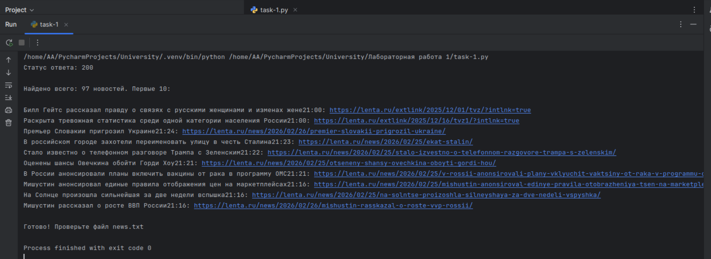
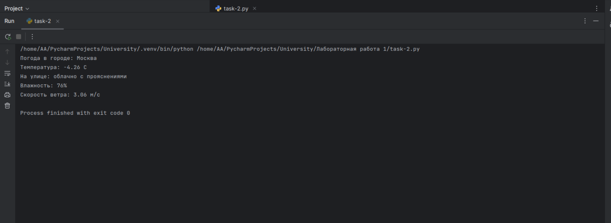

## Отчет по Заданию №1: Извлечение данных с веб-страницы

### Постановка задачи:
1. Выбрать новостной сайт (например, lenta.ru, rbc.ru и т.д.).
2. Используя библиотеку `requests`, выполнить GET-запрос к главной странице сайта.
3. С помощью библиотеки `BeautifulSoup` извлечь заголовки всех актуальных новостей и ссылки на них.
4. Вывести полученную информацию в консоль в структурированном виде.
5. Сохранить извлеченные данные в текстовый файл.

### Ход выполнения:
* С помощью метода `requests.get()` был получен HTML-код главной страницы выбранного новостного ресурса.
* Использован заголовок `User-Agent`, чтобы имитировать запрос из реального браузера и избежать блокировки.
* Библиотека `BeautifulSoup` с парсером `html.parser` была использована для навигации по DOM-дереву страницы.
* Извлечены текстовые значения заголовков и атрибуты `href` для формирования полных ссылок на статьи.
* Результат автоматически записывается в файл `news.txt`.

### Дополнительные скриншоты

* Исследование HTML-кода и определение нужных классов.

* Вывод в консоль.

**Результат:** Все найденные новости выведены в консоль и сохранены в файл `news.txt`.

## Отчет по Заданию №2: Работа с внешним API

### Постановка задачи:
1. Зарегистрироваться на сервисе [OpenWeatherMap](https://openweathermap.org/) и получить персональный API-ключ.
2. Написать скрипт, который выводит погоду в выбранном городе.
3. Выполнить запрос к API погоды для получения текущих данных (температура, влажность, описание погоды).
4. Обработать JSON-ответ от сервера.
5. Вывести информацию о погоде в удобном для чтения формате.

### Ход выполнения:
* **Авторизация:** Получен API-ключ (APPID), который передается в каждом запросе для идентификации клиента.
* **Сетевое взаимодействие:** Использован эндпоинт `data/2.5/weather`. В параметрах запроса указаны: город, ключ, язык (`lang=ru`) и система мер (`units=metric`).
* **Десериализация:** Ответ от сервера в формате JSON был преобразован в словарь Python с помощью метода `.json()`.
* **Извлечение:** Данные о температуре были взяты из ключа `['main']['temp']`, а текстовое описание — из вложенного списка `['weather'][0]['description']`.

### Дополнительные скриншоты

* Вывод в консоль.

**Результат:** Программа успешно получает и выводит актуальные метеоданные для любого указанного города.

## Отчет по Заданию №3: Теоретические основы (Контрольные вопросы)

### Постановка задачи:
1. Продемонстрировать знание теоретической базы по работе протокола HTTP, библиотек для сетевого программирования и форматов обмена данными.
