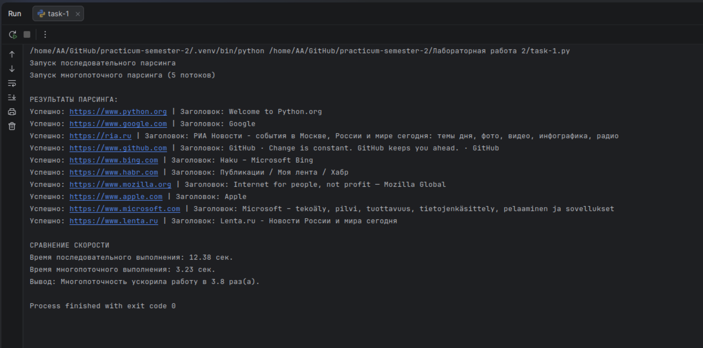

## Отчет по Заданию №1: Многопоточный парсинг данных

### Постановка задачи:
1. Выбрать список из 10-15 URL-адресов для автоматизированного сбора информации.
2. Написать функцию `parse_page(url)`, которая извлекает заголовки страниц.
3. Реализовать обязательную обработку исключений: `RequestException` (сетевые ошибки) и `AttributeError` (отсутствие элементов).
4. Сравнить время выполнения задачи в обычном (последовательном) режиме и с применением многопоточности (`ThreadPoolExecutor`).
5. Вывести данные в консоль.

### Ход выполнения:
* **Разработка функции парсинга:**
    * Внедрена обработка исключения `requests.exceptions.RequestException` для защиты от сетевых сбоев, таймаутов и ошибок подключения.
    * Использован блок `try-except` для отлова `AttributeError` на случай отсутствия тега `<title>` на странице (например, если страница пустая или повреждена).
* **Оптимизация производительности:**
    * Для реализации параллелизма использован класс `ThreadPoolExecutor` из модуля `concurrent.futures` с параметром `max_workers=5`.
    * Это позволило выполнять сетевые запросы одновременно. Программа переключается на следующий URL, не дожидаясь полного ответа от предыдущего сервера.
* **Анализ:**
    * С помощью модуля `time` произведен замер времени работы алгоритмов. 
    * Вычислен коэффициент ускорения, подтверждающий эффективность многопоточности для I/O-задач (задач ввода-вывода).

### Дополнительные скриншоты

* **Результаты парсинга и сравнение времени выполнения в консоли:**

**Результат:** Использование многопоточности позволило значительно сократить общее время выполнения программы. Среднее ускорение составило более чем в 3-4 раза.

---

## Отчет по Заданию №2: Теоретические основы (Контрольные вопросы)

### Постановка задачи:
1. Продемонстрировать знание теоретической базы по работе сетевых протоколов, библиотек для сетевого программирования и принципов параллельных вычислений в Python.