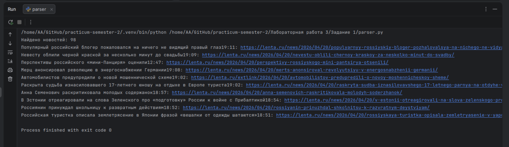
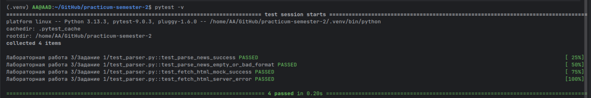
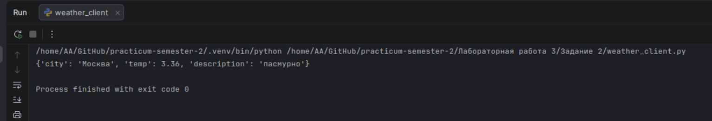
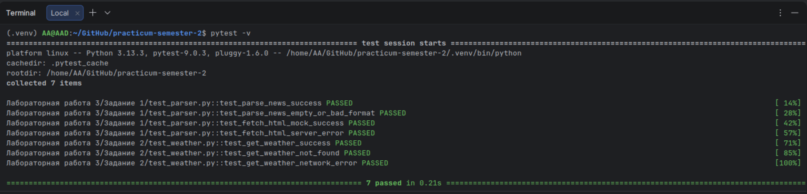

## Отчет по Заданию №1: Тестирование функций парсинга данных

### Постановка задачи:
1. Выполнить рефакторинг ранее созданного парсера для обеспечения его модульности.
2. Написать модульные тесты для функций загрузки и обработки данных с помощью pytest.
3. Использовать unittest.mock.patch для имитации HTTP-ответов от сервера, обеспечив изоляцию тестов от интернета.
4. Убедиться, что парсер корректно обрабатывает пустые данные или неожиданные форматы HTML.
5. Проверить работоспособность кода в режиме тестирования (все тесты должны иметь статус PASSED).

### Ход выполнения:
* Рефакторинг: Исходный код был разделен на две независимые функции: fetch_html (сетевой запрос) и parse_news (логика обработки дерева DOM). Это позволило тестировать логику парсинга отдельно от сетевых задержек.
* Изоляция (Mocking): С помощью декоратора @patch была произведена подмена метода requests.get. Вместо реального выхода в интернет программа получала заранее подготовленный Mock-объект с нужным статус-кодом и текстом.
* Разработка тестов: Были написаны тесты для проверки склейки относительных ссылок в абсолютные, корректности извлечения текста заголовков и обработки ошибок сервера (имитация кода 404).
* Методология: В процессе работы соблюдались принципы TDD: функции проектировались с учетом требований тестов к входным и выходным данным.

### Дополнительные скриншоты

* Результат выполнения работы файла parser.py.

* Результаты выполнения работы файла test_parser.py.

**Результат:** Модульные тесты успешно пройдены. Парсер работает стабильно, корректно обрабатывает имитируемые ответы и не зависит от доступности сайта в момент тестирования.

## Отчет по Заданию №2: Тестирование API-клиента погоды

### Постановка задачи:
1. Используя наработки из ЛР №1, создать модульный клиент для погодного API (OpenWeatherMap).
2. Написать функцию get_weather, которая принимает название города и API-ключ, возвращая структурированные данные (температура, описание).
3. Реализовать модульные тесты с использованием pytest.
4. Применить unittest.mock.patch для полной изоляции тестов от внешнего API и проверки логики при отсутствии интернет-соединения.

### Ход выполнения:
* Модульность: Проведен рефакторинг кода. Логика запроса и обработки JSON вынесена в функцию get_weather, что позволило тестировать её отдельно от основного интерфейса вывода.
* Изоляция зависимостей (Mocking): С помощью патчинга (@patch) библиотека requests была заменена на объект-заглушку. Это позволило:
  - Имитировать успешный ответ API с заранее заданным JSON-контентом.
  - Проверить реакцию программы на ошибку 404 (город не найден).
  - Имитировать обрыв связи с помощью side_effect = Exception().
* Обработка исключений: В код клиента добавлен блок try-except, который перехватывает сетевые ошибки. Тестирование подтвердило, что в случае сбоя или отсутствия интернета программа не «падает», а корректно возвращает None.

### Дополнительные скриншоты

* Результат выполнения работы файла weather_client.py.

* Результаты выполнения работы файла test_weather.py.

**Результат:** API-клиент успешно протестирован. Благодаря использованию Mock-объектов, проверка функционала проводится мгновенно и не требует реальных запросов к серверу, что экономит лимиты API и обеспечивает стабильность тестов.

## Отчет по Заданию №3: Теоретические основы (Контрольные вопросы)

### Постановка задачи:
1. Продемонстрировать знание теоретической базы.