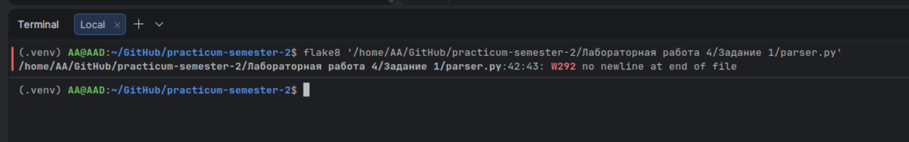
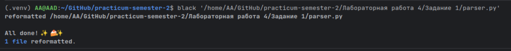
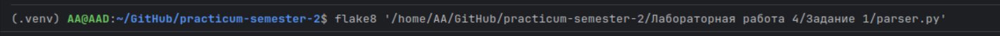
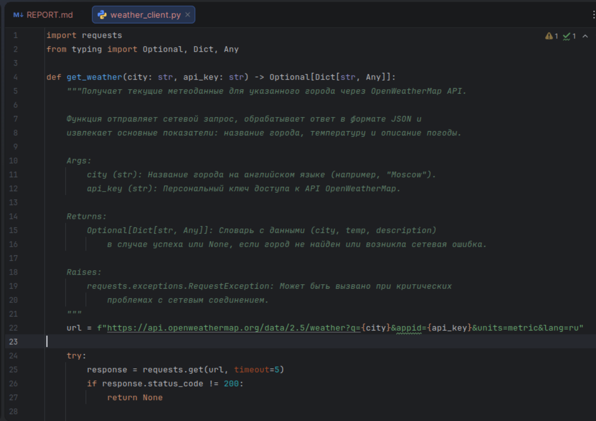
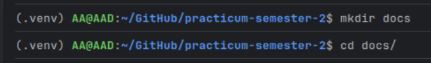
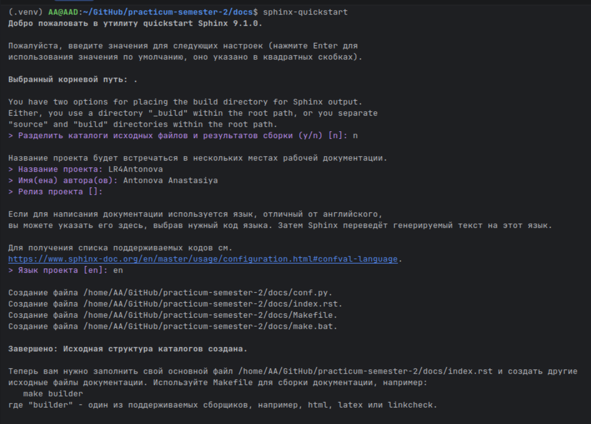
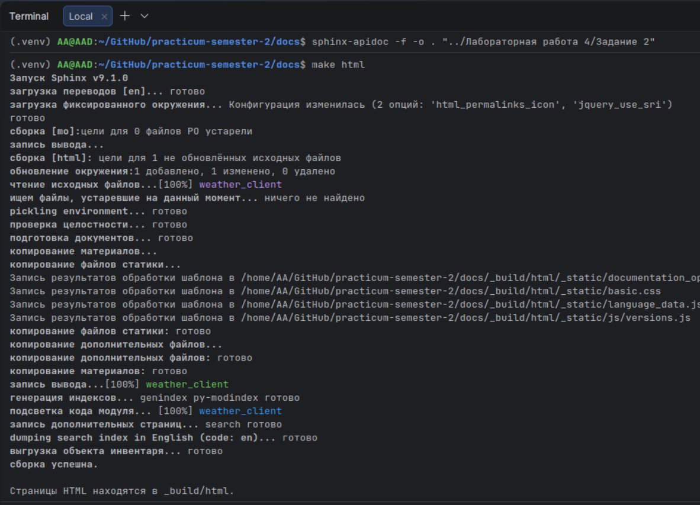
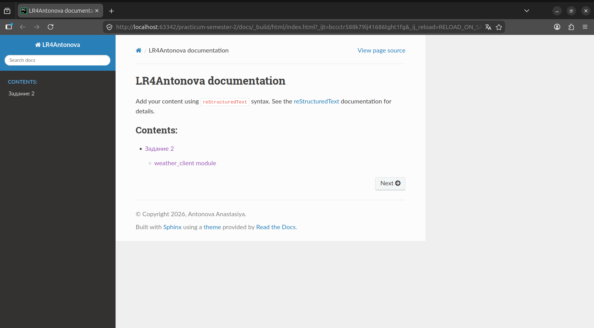
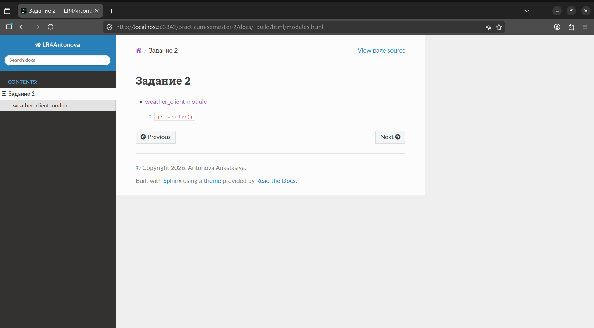
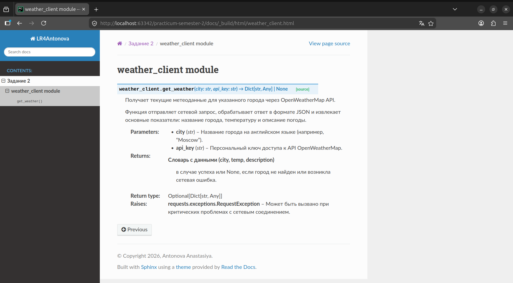

## Отчет по Заданию №1: Приведение кода к стандартам PEP 8 и форматирование

### Постановка задачи: 

1. Выбрать файл из предыдущих ЛР (парсер Lenta.ru).
2. Установить и запустить flake8 для анализа ошибок стиля.
3. Использовать black для автоматического форматирования.
4. Исправить оставшиеся ошибки вручную.

### Ход Выполнения:

* Статический анализ: Утилита flake8 была запущена в терминале PyCharm. Она выявила нарушение стандарта PEP 8: отсутствие пустой строки в конце файла (W292).
* Автоматическое форматирование: Использован форматер black, который автоматически привел код к единообразному стилю.
* Изменения: black стандартизировал использование кавычек, добавил необходимые отступы вокруг операторов и ограничил длину строк до 79 символов.
* Ручная правка: Вручную были удалены неиспользуемые импорты, которые black не обрабатывает по своей логике.

### Дополнительные скриншоты

* Скрин терминала с ошибками flake8 (до исправления).

При проверке через flake8 была обнаружена ошибка W292. Согласно рекомендациям PEP 8 , я вручную добавил пустую строку в конец файла, так как black не всегда исправляет этот специфический момент в зависимости от версии или настроек, а flake8 строго следит за соответствием стандартам.

* Скрин терминала после работы black (сообщение "1 file reformatted").

До запуска black была только одна ошибка W292 (отсутствие пустой строки в конце). После запуска black файл был приведен к единому стандарту кавычек и форматирования.

* Скрин терминала c flake8 (после исправления и black).

**Результат:** В ходе выполнения задания код был приведен к стандарту PEP 8: исправлена ошибка W292 (отсутствие пустой строки в конце файла), проведена унификация кавычек и форматирования с помощью Black.

## Отчет по Заданию №2: Документирование кода и генерация документации с Sphinx

### Постановка задачи: 

1. Добавить в код (модуль погоды weather_client.py) документацию в формате Google Style Docstrings.
2. Установить и настроить генератор документации Sphinx.
3. Сгенерировать HTML-документацию, отображающую структуру модулей и описание функций.

### Ход выполнения:

* Документирование: Ко всем функциям и модулю были добавлены строки документации docstrings. В описании каждой функции выделены блоки Args (аргументы), Returns (возвращаемое значение) и Raises (возможные исключения).
* Инициализация Sphinx: В корне проекта создана папка docs, где с помощью команды sphinx-quickstart была развернута базовая структура документации.
* Настройка конфигурации: В файле conf.py был вручную настроен путь к исходному коду (sys.path.insert) и подключены необходимые расширения: autodoc (для извлечения документации из кода) и napoleon (для поддержки стиля Google). Также была установлена тема оформления sphinx_rtd_theme.
* Генерация: С помощью утилиты sphinx-apidoc были созданы .rst файлы для модулей, после чего командой make html была собрана финальная версия сайта.

### Дополнительные скриншоты

* Скриншот исходного кода с Docstrings:

Скриншот процесса сборки документации в терминале:

Скриншот главной страницы сгенерированной документации (index.html):

Скриншот страницы модуля с описанием функции (modules.html):

**Результат:** Была создана полноценная техническая документация проекта. Код стал самодокументированным, а сгенерированный HTML-сайт позволяет удобно просматривать структуру функций и их описание в браузере.

## Отчет по Заданию №3: Теоретические основы (Контрольные вопросы)

### Постановка задачи:
1. Продемонстрировать знание теоретической базы.